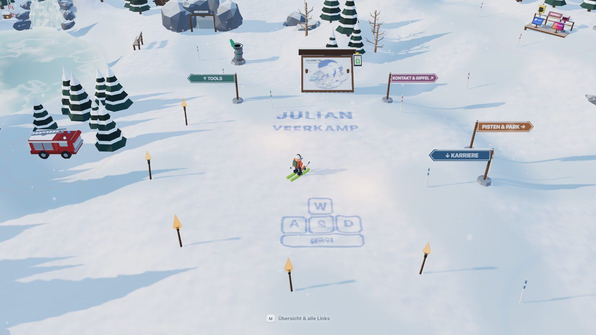

# Julian Veerkamp · [veerka.mp](https://veerka.mp)

Persönliche Website als 3D-Skigebiet im Browser. Die Links sind Stationen
im Tal, die man erkunden kann. Mit `M` stehen alle Links auch
als Liste zur Verfügung, wenn man keine Lust hat zu spielen.



## Inhalt

| Station | Ziel |
|---|---|
| Werkstatt | LinkedIn, GitHub |
| Kontaktposten | Signal, Instagram |
| Skikasse | PayPal, Solana, Tickets für Drohnen-Rundflug und Kabelsee |
| Rohrpost | Upload (upload.veerka.mp) |
| Abkürzung | Kurzlink (s.veerka.mp) |
| Stechuhr | Arbeitszeitrechner (zeit.veerka.mp) |
| Materialdepot | Packliste (packliste.veerka.mp) |
| Drohne | Uniprojekt, Rundflug (nicht auf der Karte) |
| Löschzug | Lernwerkstatt der Jugendfeuerwehr (nicht auf der Karte) |
| Gefrorene Quelle | aktuelle Sendung von broadcast.veerka.mp (nicht auf der Karte) |
| Badesteg am Eissee | mit Ticket: Countdown, dann verwandelt sich das Tal in den Kabelsee |

Außerdem: Schlepplift, Nordabfahrt, Funpark, Slalom mit Bestenliste,
Speedcheck, Kinderland mit Zauberteppich, Hütte mit Terrasse.

Vom Badesteg geht es in den Sommer: der **Kabelsee**, Wasserski am Kabel
rund um eine Insel, mit eigener Bestenliste. Esc führt zurück in den
Winter. Allein spielbar unter `/kabelsee/`; Steuerung und Regeln in
[src/kabelsee/README.md](src/kabelsee/README.md). Der
Pistenpass speichert lokal, welche Orte man gefunden hat, dazu
Slalom-Medaillen und Abzeichen. Die Seite hat keinen Ton.

Ohne WebGL oder JavaScript zeigt die Seite eine Linkliste mit denselben
Einträgen. Sie wird beim Build ins HTML geschrieben.

## Steuerung

| Taste | |
|---|---|
| `W` `A` `S` `D` / Pfeile | fahren, lenken, bremsen (aus Sicht des Fahrers) |
| `Shift` | kanten |
| `Leertaste` | springen, im Funpark Tricks |
| `Enter` / `E` | Station benutzen |
| `M` | Übersicht: Links, Talkarte, Pistenpass, Bestenliste |
| `R` | zurück zum Start |

Am Handy: Daumenstick an der Stelle, an der man den Bildschirm berührt;
Stationen lassen sich antippen; die Übersicht liegt hinter dem Knopf oben
rechts.

## Technik

- three.js r185 und Vite 8, JavaScript-Module ohne Framework. Geometrie und
  Texturen werden im Code erzeugt; es gibt keine Modell- oder Bilddateien.
- Eine Höhenfunktion (`src/world/heightfield.js`) liefert Gelände-Mesh und
  Kollision.
- Feste Kamera, die sich nicht dreht; Ausnahmen sind die Nordabfahrt und
  der Drohnen-Rundflug.
- Cloudflare Worker mit statischen Assets. Der Worker bearbeitet `/` und
  `/api/*`: Umleitung von www, Bestenlisten von Slalom und Kabelsee in D1,
  Durchreiche der Sendung von broadcast.veerka.mp.
- Der Kabelsee wird erst am Badesteg nachgeladen und zeichnet im selben
  Renderer wie das Tal; der Übergang mischt beide Bilder in einem Shader.

## Entwickeln

```bash
npm install
npm run dev          # Tal auf http://localhost:5173, Kabelsee auf /kabelsee/
npm run dev:api      # Worker auf :8787, Vite leitet /api dorthin weiter
npm test             # node --test
npm run build
```

Bestenliste lokal: Datenbank anlegen und ein Geheimnis für die Marken
setzen.

```bash
npx wrangler d1 migrations apply skiportfolio-slalom --local
echo "SLALOM_GEHEIM=irgendwas-langes" > .dev.vars
```

Uploads gehen lokal an `http://localhost:8788`, nicht an
upload.veerka.mp. Dafür im Repo des Uploaders `npm run dev` starten und in
dessen `.dev.vars` `DEV_HERKUNFT` auf den Port der Seite setzen (5173 mit
`npm run dev`, 8787 mit `npm run dev:api`).

Zum Prüfen im Browser: `window.__ski.goto('kasse')` setzt den Fahrer vor
eine Station, `window.__ski.step(frames, dt)` rechnet die Welt weiter, auch
in einem verborgenen Fenster.

## Veröffentlichen

Jeder Push auf `main` wird über Cloudflare Workers Builds gebaut und als
Worker `website` veröffentlicht (etwa 40 Sekunden). Manuell:
`npm run deploy`. `npm run dev:api` liefert die Seite lokal so aus wie in
Produktion.

Das Geheimnis für die Bestenliste liegt als Secret am Worker:
`npx wrangler secret put SLALOM_GEHEIM`.

## Aufbau

```
src/
  core/         Geometrie, Eingabe, Handymodus
  world/        Gelände, Aufbau des Tals (populate.js), Schnee, Himmel,
                Rohrpost-Versand
    attractions/  Lift, Zauberteppich, Rail, Slalom, Speedcheck, Nordabfahrt
    areas/        Kinderland, Hütte mit Terrasse
    props/        ein Modul je Objekt
  player/       Fahrmodell, Figur, Kamera, Drohnen-Rundflug
  stations/     Stationen, Links, Interaktion
  menu/         Übersicht, Linkliste, Hinweise, Pistenpass, Bestenliste
  dialogs/      Fenster für Solana, Upload, Kurzlink
  sommer/       Badesteg-Countdown, Verwandlung, Bestenliste des Kabelsees
  kabelsee/     Der Kabelsee (eigene README)
kabelsee/       Eigene Seite des Kabelsees (index.html)
worker/         Cloudflare Worker: Router, Bestenlisten, Broadcast
public/         Icons
tools/          skifahrer-icon.mjs erzeugt das Homescreen-Icon; kabelsee/
                Bilder und Video des Sees
docs/           Bilder fürs README, docs/kabelsee/ für den See
tests/          node --test
```

## Externe Dienste

| Dienst | Verwendung | Voraussetzung |
|---|---|---|
| [s.veerka.mp](https://s.veerka.mp) | Kurzlink-Fenster | Host in `TURNSTILE_HOSTNAMES` und im Turnstile-Widget |
| [upload.veerka.mp](https://upload.veerka.mp) | Upload-Fenster an der Rohrpost | Herkunft in `CORS_HERKUNFT` des Upload-Workers |
| [broadcast.veerka.mp](https://broadcast.veerka.mp) | Anzeige in der gefrorenen Quelle | keine, der Worker holt die Daten serverseitig |
| [jf.veerka.mp](https://jf.veerka.mp) | Ziel des Löschzugs, Übergabe mit `?einfahrt=1` | siehe `docs/verwandte-projekte.md` im Repo der Lernwerkstatt |
| Solana RPC, CoinGecko, Binance | Solana-Fenster | keine (CORS `*`) |

## Weitere Dokumentation

- [HANDOVER.md](HANDOVER.md): ausführlicher Stand, Entscheidungen mit
  Begründung, Verworfenes, offene Punkte.
- [CLAUDE.md](CLAUDE.md): Regeln für die Arbeit mit Coding-Agenten.

Die frühere Kachelseite von veerka.mp liegt in der Historie dieses Repos
(`git log def8f43`).
