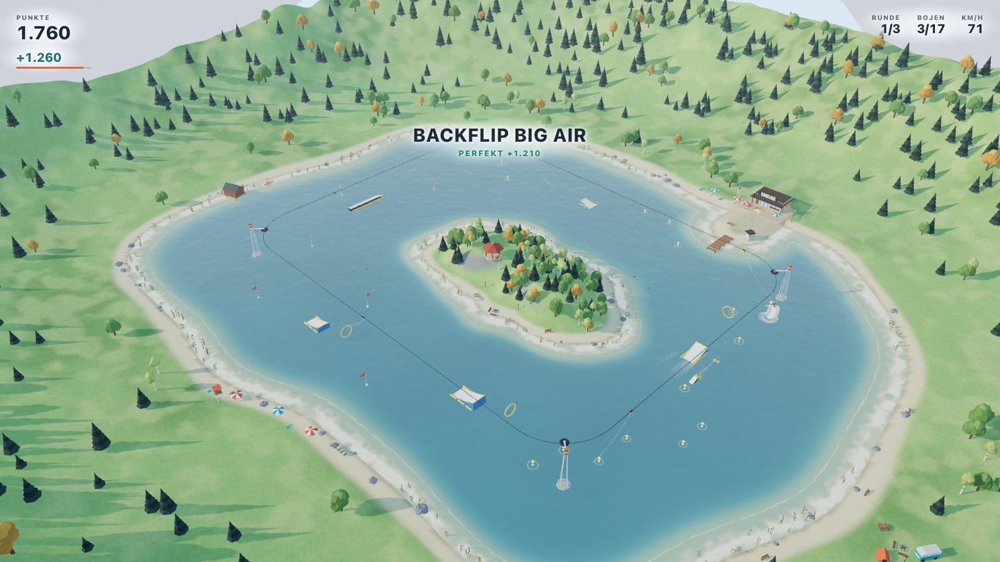
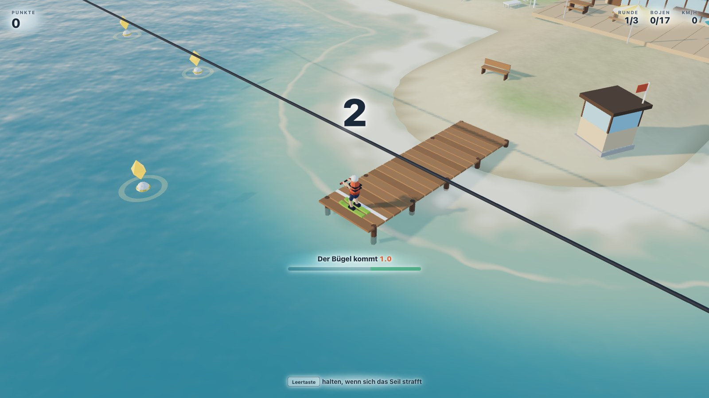
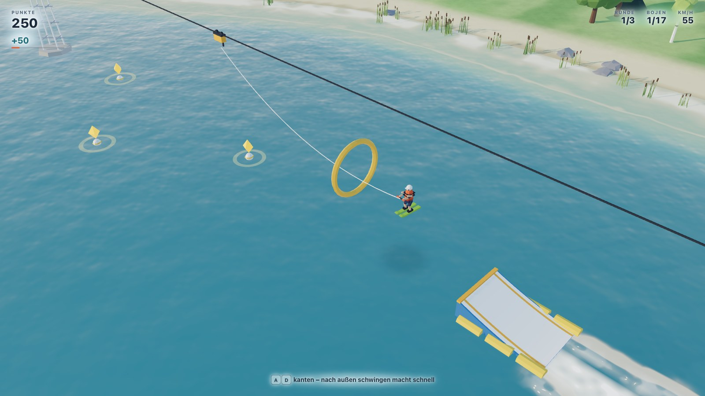
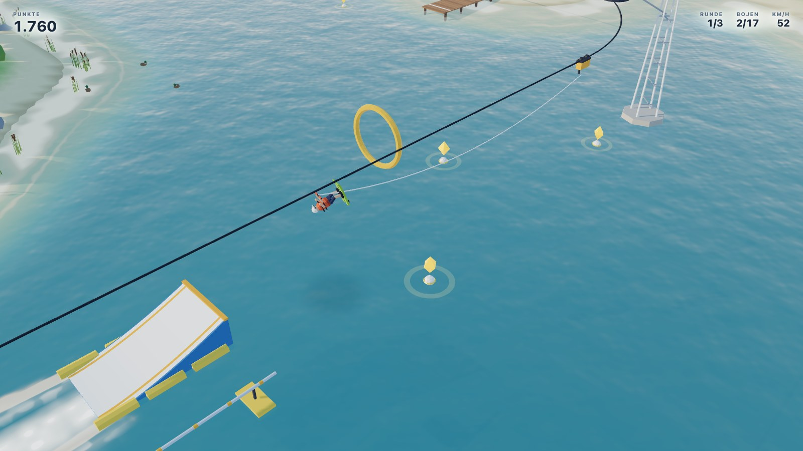
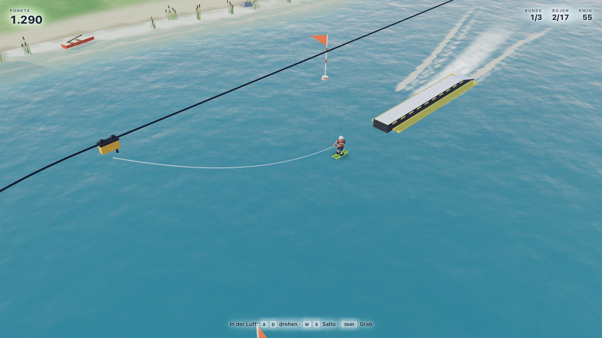
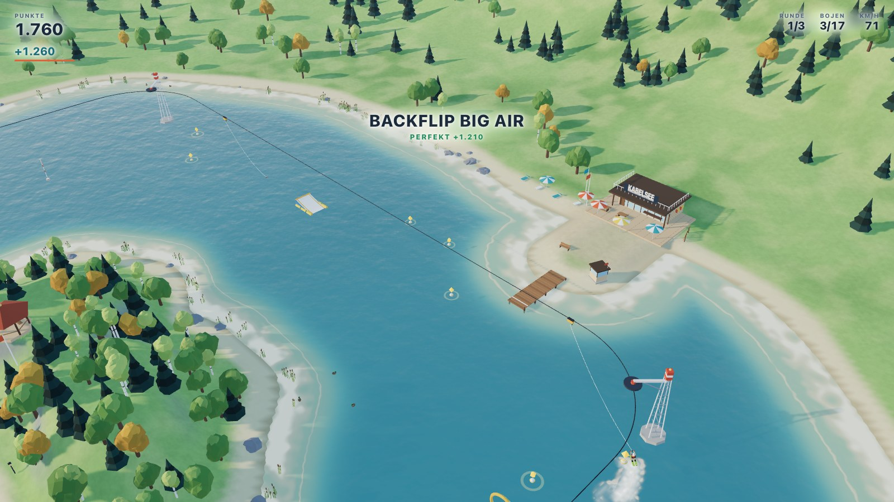
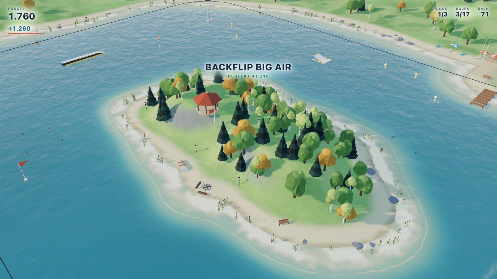

# Kabelsee

Wasserski am Kabel rund um eine kleine Insel. Ein 3D-Spiel für den Browser,
gebaut mit three.js, ganz ohne Server und ohne geladene Modelle oder Bilder:
jede Tanne, jeder Mast und jede Boje entsteht im Code.

Er gehört zum Skital von [veerka.mp](https://veerka.mp) und liegt seit
dem 01.10.2026 in dessen Repo: Vom Badesteg am Eissee verwandelt sich das
Tal in diesen See (`src/sommer/`, HANDOVER 4a⁶), und unter `/kabelsee/`
läuft er für sich allein. Kamera, Licht, Glas und Frosttext sind dieselben
wie im Tal; dort liegt Schnee, hier ein Sommersee.



| | |
|---|---|
|  |  |
|  |  |
|  |  |

Ein kurzes Video liegt unter [docs/kabelsee.webm](../../docs/kabelsee/kabelsee.webm).

## Spielen

```bash
npm install
npm run dev          # http://localhost:5173/kabelsee/ (allein), / (vom Badesteg aus)
```

Online unter **veerka.mp/kabelsee/** und vom Badesteg im Tal. Allein ist der
Titel das Menü: Enter fährt los, `B` zeigt die Bestenliste, darunter geht es
ins Skital; `Esc` führt aus Fahrt und Auswertung zurück ins Menü (am Handy
der Knopf ☰ oben rechts, darunter ↻ für eine neue Session). Im Tal gibt es keinen Titel: man steht gleich am
Steg, nach drei Runden geht es mit Enter weiter und mit `Esc` zurück in
den Winter. `B` trägt in beiden Fällen nach einem neuen Rekord in die
Bestenliste ein und zeigt sie sonst nur an.

| Taste | auf dem Wasser | in der Luft |
|---|---|---|
| `A` `D` / Pfeile | Kanten: nach außen schwingen, zurück in die Linie; auf Box und Rail die Ski quer stellen | drehen (180, 360, 540 …) |
| `W` | an der Hantel ziehen | Salto vorwärts |
| `S` | zurücklehnen, bremsen | Salto rückwärts |
| `Leertaste` | halten federt ein, loslassen springt | |
| `Shift` | | Grab |
| `Enter` | Session starten | |
| `R` | zurück an den Steg | |
| `B` | Bestenliste (nach neuem Rekord: eintragen) | |
| `Esc` | Menü (im Tal: zurück in den Winter) | |
| Mausrad | Kamera näher oder weiter | |

Am Handy gibt es Tasten, belegt wie die Tastatur: links die Wippe ◀ ▶
(A/D, je weiter außen der Daumen, desto stärker), rechts die Wippe ▲ ▼
(W/S), die große Taste **Sprung** (Leertaste) und **Grab**.

## So läuft eine Session

**Start am Steg.** Der Fahrer steht vorn auf dem Startsteg, über ihm läuft
das Kabel. Ein Mitnehmer kommt, mal nach zweieinhalb, mal nach gut vier
Sekunden; die letzten drei zählt die Anzeige herunter. Das Seil hängt erst
durch und strafft sich dann, und sobald es fast straff ist, steht **JETZT!**
im Bild. Wer in dem Moment in der Hocke ist (Leertaste halten), wird sauber
vom Steg gezogen. Wer die Hocke erst in der letzten knappen halben Sekunde
einnimmt (der grüne Teil im Balken), bekommt den **Katapult-Start**: 250
Punkte, Schwung und ein hoher Satz vom Steg, in dem man schon drehen darf –
ein 180 geht sicher. Wer steht, wird ins Wasser gerissen und probiert es mit
dem nächsten Bügel noch einmal.

**Fahren.** Das Seil zieht mit 54 km/h um die Insel. Ohne Lenken hängt man
genau hinter dem Mitnehmer. Mit `A`/`D` stellt man die Ski schräg und
schwingt nach außen: das Seil zieht dann schräg, das Wasser lässt nur die
Längsrichtung der Ski durch, und man wird schneller als das Seil, bis gut
85 km/h. Wer zu weit ausschwingt, merkt, wie die Ski von selbst flacher
werden. Ins Flache am Ufer oder steil gegen eine Rampe fahren heißt Sturz;
wer schräg an der Seite eines Kickers entlangschrammt, gleitet nur ab. Wer
Tempo verliert, gleitet nicht mehr und sinkt bis zu den Knöcheln ein.

**Rückwärts.** Mit Tempo reicht ein Sprung auf flachem Wasser für einen 180,
danach fährt man rückwärts weiter, die Hantel hinter dem Rücken. Das Lenken
ist dabei etwas zäher, und an der Hantel ziehen geht nicht. Sprünge, die man
rückwärts beginnt, heißen *Switch* und geben 25 Prozent mehr; ein zweiter 180
dreht einen wieder um.

**Kicker, Box und Rail.** Vier Kicker in drei Größen, eine Box und eine Rail
stehen auf den Geraden. Der kleine Kicker liegt genau auf der Linie, die
drei anderen seitlich versetzt; die muss man anfahren. Auf der Ostgeraden
liegt die Rail auf der Linie und der Kicker innen daneben: wer geradeaus
fährt, slidet, wer springen will, zieht vorher nach innen. Auf Box und Rail
springt man auch schräg von der Seite auf oder landet schräg darauf, die
Kante hält einen in der Spur. Mit `A`/`D` dreht man sich darauf; ohne Taste
rastet man längs, quer oder rückwärts ein. Quer gerutscht zählt
anderthalbfach, und eine Drehung auf der Box zählt beim Absprung mit: wer
auf der Rail einen 360 dreht und gerade herunterkommt, hat einen 360. Vor der Kante `Leertaste` halten und an der
Kante loslassen gibt den höchsten Absprung (kurz danach loslassen zählt auch
noch). In der Luft drehen `A`/`D`, `W`/`S` schlagen einen Salto, `Shift`
greift an die Ski. Wer nichts drückt, wird von selbst auf die nächste
Landestellung gedreht: beim Drehen die nächste halbe Umdrehung, beim Salto
die nächste ganze. Gewertet wird die Landung: **Perfekt** (×1,5),
**Sauber**, **Wackelig** (×0,55, kostet Tempo) oder Sturz, und gestürzt wird
erst, wer wirklich quer oder wirklich schräg (knapp 70 Grad daneben)
aufkommt.

**Slalom.** Auf der West- und der Südgeraden stehen sechs Fahnen im Wechsel
innen und außen, je 10 m neben der Linie und 26 m auseinander. Der Wimpel
zeigt, auf welcher Seite man vorbei muss: außen um die Fahne herum, so weit
hinaus, dass das Seil straff ist. Auf der Südgeraden führt der Slalom innen
am einen und außen am anderen Kicker vorbei, statt darüber. Jede Fahne gibt
mehr als die vorige derselben Runde (300, 450 … 1050). Wer in einer Runde
alle sechs schafft, bekommt **8000** – einmal je Session; danach versinken
die Fahnen im See, und die Geraden gehören wieder den Kickern. Bis dahin
zählen die Fahnen in jeder Runde neu.

**Punkte wie in Steep.** Jede Figur zählt für sich, aber die großen Zahlen
macht die **Kombo**: wer innerhalb von 3,5 Sekunden nach einer Landung den
nächsten Trick steht, hält die Kette am Leben, und jede neue Figur hebt den
Faktor bis ×5. Läuft die Zeit ab, wird die Kette ausgezahlt; ein Sturz
löscht sie.

**Sammeln** geht direkt aufs Konto, nicht in die Kombo – belohnt wird, wer
alles holt:

| | einzeln | alle |
|---|---|---|
| 17 **Bojen** (leuchtender Stein über dem Schwimmer) | 100 | +10 000 |
| 4 **Ringe** über den Kickern, am Scheitel eines geladenen Sprungs | 1000 → 2000 → 4000 → 8000 | +10 000 |
| 6 **Tore** im Slalom | 300 … 1050 je Fahne einer Runde | +10 000 für alle in einer Runde, einmal je Session |

Dazu 300 Punkte für jede Runde. Wer alle Bojen, alle Ringe und alle Tore
einer Runde in derselben Session holt, bekommt das Abzeichen **Abgeräumt**
im Pistenpass von veerka.mp.

Ein **Grab** zählt nur, wenn man die Ski vor dem Aufsetzen wieder loslässt.

**Abwechslung** lohnt sich: derselbe Trick gibt in einer Session beim
ersten Mal alles, danach jedes Mal 30 Prozent weniger, bis auf 20 Prozent.
Ein Grab oder Switch macht daraus einen anderen Trick, mehr Höhe nicht.

Trickwerte: 180 = 150, 360 = 300, 540 = 550, 720 = 800, 1080 = 1500;
Backflip = 550, Frontflip = 550, Doppelsalto = 1500. Salto mit Drehung ist
ein **Cork** (rückwärts) oder **Rodeo** (vorwärts) und gibt 20 Prozent mehr
als beides einzeln. Grab 150 plus Haltezeit; Big Air ab 1,6 s Flug; Box 45
und Rail 55 je Meter. Namen setzen sich zusammen, etwa „Switch Cork 540
Method“.

Nach drei Runden lässt der Fahrer das Seil los, und die Auswertung zeigt
Punkte, besten Trick, größte Kombo, Bojen, Ringe, Slalom-Tore, Spitzentempo
und Stürze.
Der Rekord bleibt im Browser (`localStorage`).

## Technik

- **three.js 0.186** und **Vite 8**, JavaScript-Module ohne Framework. Alles
  läuft im Browser; es gibt keinen Server, keine Assets außer einem Favicon.
- **Eine Höhenfunktion** (`src/world/heightfield.js`) beschreibt See, Insel,
  Ufer und Hügel. Aus ihr entstehen das Gelände-Mesh, die Tiefenkarte des
  Wassers und die Ufer-Kollision.
- **Das Fahrmodell** (`src/player/rider-physics.js`) ist eine eigene kleine
  Rechnung ohne Physik-Engine: ein Punkt mit Geschwindigkeit, das Seil als
  steife Feder zum Mitnehmer, Wasser, das quer zu den Ski hart und längs
  kaum bremst. Es läuft in festen Schritten von 1/120 s und ohne three.js,
  damit die Tests damit ganze Runden im Terminal fahren können. Rückwärts
  ist dieselbe Rechnung, nur steht die Figur umgedreht darauf; auf Box und
  Rail ersetzt eine Führung die Wasserrechnung.
- **Was man befährt, ist Rechnung; was man sieht, folgt ihr**
  (`src/world/features.js`): Kicker und Box sind Profile, aus denen sowohl
  der Absprung als auch die Geometrie gebaut wird. Dort stehen auch Bojen,
  Ringe und die Slalomfahnen; gewertet wird der Slalom in
  `src/game/slalom.js`.
- **Wasser** (`src/world/water.js`): eigener Shader mit Farbe aus der Tiefe,
  zwei ziehenden Rauschlagen für die Kräuselung, Himmel im Streiflicht,
  Sonnenglitzer, Uferschaum, dem Schatten des Fahrers und dem **Kielwasser**
  aus `src/world/wake.js`. Das Kielwasser wird jedes Bild aus einer Liste von
  Wegpunkten neu gemalt, darum laufen die beiden Wellen mit dem Alter
  auseinander wie hinter einem Boot.
- **Kamera** (`src/player/camera.js`) wie im Skital: fest von schräg oben
  (Azimut 45°, 36° über dem Horizont, 38° Bildwinkel), sie dreht sich nie.
  Neu ist nur, dass sie mit dem Tempo atmet (bis zu 4 m weiter weg und 7°
  mehr Bildwinkel), und dass sie am Steg näher herangeht.
- Rechnung je Bild um 0,2 bis 0,5 ms; Pixelbudget wie im Skital (Handy
  höchstens 1,5-fach, Desktop höchstens 4,2 Mio. Pixel).

Zum Prüfen im Browser gibt es `window.__kabel`: `step(frames, dt)` rechnet
die Welt weiter (auch ohne laufende Schleife), `keys(['jump'])` drückt
Tasten, `overview()` zeichnet den ganzen See von oben.

## Entwickeln

Alles aus dem Wurzelverzeichnis des Repos:

```bash
npm run dev          # Entwicklungsserver
npm test             # node --test, die Tests des Sees heissen tests/kabelsee-*
npm run build        # dist/, darin dist/kabelsee/
node tools/kabelsee/bilder.mjs   # Bilder nach docs/kabelsee/ (nach dem Build)
node tools/kabelsee/video.mjs    # docs/kabelsee/kabelsee.webm (ffmpeg mit VP8)
```

Bilder und Video brauchen Playwright (`npm i -D playwright` oder global).
Sie starten `vite preview`, öffnen `/kabelsee/` in Chromium und spulen die
Welt mit `__kabel.step()` in feste Momente vor. Darum sehen die Bilder bei
jedem Lauf gleich aus.

## Veröffentlichen

Mit der Website: jeder Push auf `main` des Repos geht über Cloudflare
Workers Builds live (Worker `website`), der See liegt dann unter
veerka.mp/kabelsee/. Die Bestenliste ist `worker/kabelsee.js` mit der
Tabelle aus `worker/migrations/0002_kabelsee.sql`.

Das alte Repo `Kabelsee` ist archiviert, der Worker `kabelsee` und die
Adresse kabelsee.veerka.mp sind gelöscht (01.10.2026).

## Aufbau

```
src/kabelsee/
  see.js          der See als Baustein (createKabelsee), ohne eigenen Renderer
  main.js         Einstieg der eigenen Seite /kabelsee/
  kabelsee.css    Anzeige, alles unter .kabelsee-hud
  config.js       alle Stellschrauben: See, Insel, Kabel, Fahrer, Tricks, Kamera, Farben
  core/           Tastatur und Touch (Geometrie, Zufall, Rauschen: src/core/)
  world/          Höhenfeld, Gelände, Wasser, Kielwasser, Himmel, Kabelbahn,
                  Hindernisse und Sammelsachen, Aufbau der Gegend (populate.js)
  props/          Bäume, Masten und Mitnehmer, Seil, Kicker und Box,
                  Station, Pavillon, Zelte, Bulli, Boote, Schilf, Enten …
  player/         Fahrmodell, Figur, Kamera, Gischt
  game/           Mitnehmer, Tricks und Kombo, Slalom, Ablauf der Session, Anzeige
tests/kabelsee-*  node --test (kabelsee-helfer.js: der Testfahrer)
tools/kabelsee/   bilder.mjs, video.mjs
docs/kabelsee/    Bilder und Video
```

Regeln für die Arbeit am Code (auch für Coding-Agenten) stehen im
[CLAUDE.md](../../CLAUDE.md) des Repos und in HANDOVER.md, Abschnitt 4a⁶.

## Die Gegend

Im Norden die Anlage mit Kiosk, Dachterrasse, Sonnenschirmen, Board-Ständer
und dem Startsteg auf einer Landzunge; die Station zeigt mit der Schauseite
zur Kamera, wie alles im Skital. Im Osten eine Zeltwiese mit Bulli und
Lagerfeuer, im Süden der Badestrand mit Rettungsturm, im Westen ein
Bootshaus. Auf der Insel ein Pavillon auf der Kuppe, ein Lagerfeuer am Strand,
ein Ruderboot und ein Wäldchen aus Kiefern, Birken und ersten gelben
Laubbäumen. Ringsum Wald, der nach außen dichter wird, Schilf im Flachwasser
und drei Entenfamilien.
